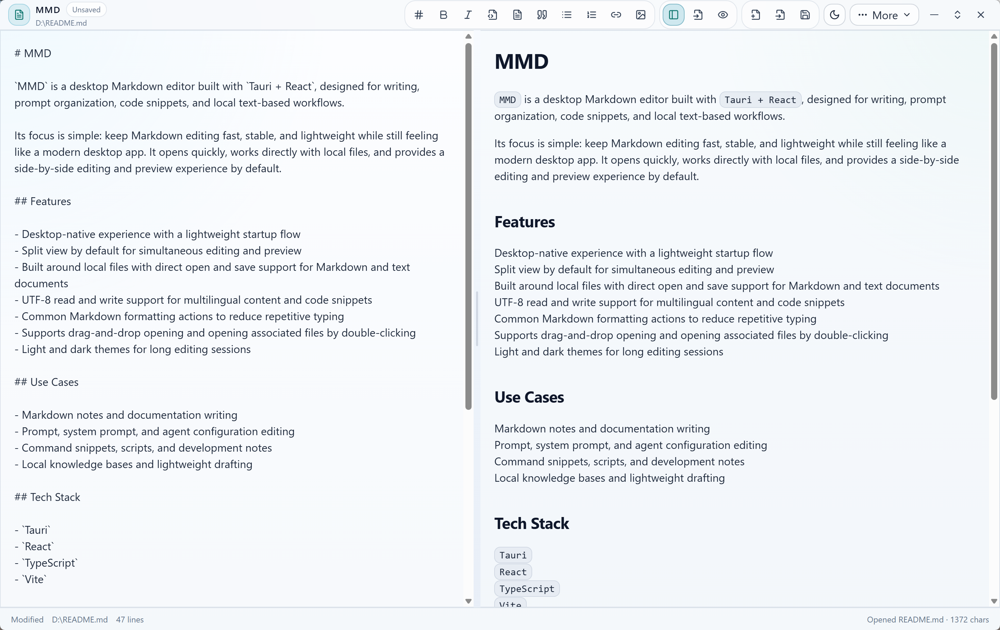

# MMD

`MMD` is a desktop Markdown editor built with `Tauri + React`, designed for writing, prompt organization, code snippets, and local text-based workflows.

Its focus is simple: keep Markdown editing fast, stable, and lightweight while still feeling like a modern desktop app. It opens quickly, works directly with local files, and provides a side-by-side editing and preview experience by default.

## Preview



## Features

- Desktop-native experience with a lightweight startup flow
- Split view by default for simultaneous editing and preview
- Built around local files with direct open and save support for Markdown and text documents
- UTF-8 read and write support for multilingual content and code snippets
- Common Markdown formatting actions to reduce repetitive typing
- Supports drag-and-drop opening and opening associated files by double-clicking
- Light and dark themes for long editing sessions

## Use Cases

- Markdown notes and documentation writing
- Prompt, system prompt, and agent configuration editing
- Command snippets, scripts, and development notes
- Local knowledge bases and lightweight drafting

## Tech Stack

- `Tauri`
- `React`
- `TypeScript`
- `Vite`

## Development

```powershell
npm install
npm run tauri dev
```

## Build

```powershell
npm run build
```

## License

Licensed under the Apache License, Version 2.0. See `LICENSE` for details.
